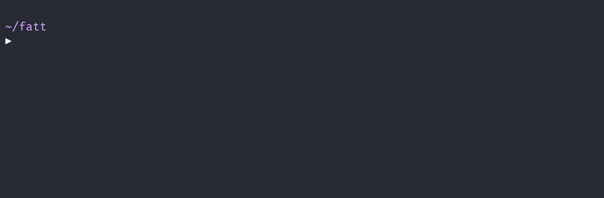

# podcast-dl

## A CLI for downloading podcasts with a focus on archiving.

## How to Use

### Binaries

[Visit the releases page](https://github.com/lightpohl/podcast-dl/releases) and download the latest binary for your system.

`podcast-dl --url <PODCAST_RSS_URL>`

`podcast-dl --url "http://friendsatthetable.libsyn.com/rss"`

### npx

**[Node Required](https://nodejs.org/en/)**

`npx podcast-dl --url <PODCAST_RSS_URL>`

## Options

| Option                  | Type                       | Required | Description                                                                                                                                                   |
| ----------------------- | -------------------------- | -------- | ------------------------------------------------------------------------------------------------------------------------------------------------------------- |
| --url                   | String                     | true     | URL to podcast RSS feed.                                                                                                                                      |
| --out-dir               | String                     | false    | Specify output directory for episodes and metadata. Defaults to "./{{podcast_title}}". See "Templating" for more details.                                     |
| --archive               | String                     | false    | Download or write out items not listed in archive file. Generates archive file at path if not found. See "Templating" for more details.                       |
| --episode-template      | String                     | false    | Template for generating episode related filenames. See "Templating" for details.                                                                              |
| --include-meta          |                            | false    | Write out podcast metadata to JSON.                                                                                                                           |
| --include-episode-meta  |                            | false    | Write out individual episode metadata to JSON.                                                                                                                |
| --ignore-episode-images |                            | false    | Ignore downloading found images from --include-episode-meta.                                                                                                  |
| --offset                | Number                     | false    | Offset starting download position. Default is 0.                                                                                                              |
| --limit                 | Number                     | false    | Max number of episodes to download. Downloads all by default.                                                                                                 |
| --list-format           | String ("table" \| "json") | false    | How to structure list data when logged. Default is "table".                                                                                                   |
| --episode-regex         | String                     | false    | Match episode title against provided regex before starting download.                                                                                          |
| --add-mp3-metadata      |                            | false    | Attempts to add a base level of MP3 metadata to each episode. Recommended only in cases where the original metadata is of poor quality. (**ffmpeg required**) |
| --adjust-bitrate        | String (e.g. "48k")        | false    | Attempts to adjust bitrate of MP3s. (**ffmpeg required**)                                                                                                     |
| --mono                  |                            | false    | Attempts to force MP3s into mono. (**ffmpeg required**)                                                                                                       |
| --override              |                            | false    | Override local files on collision.                                                                                                                            |
| --reverse               |                            | false    | Reverse download direction and start at last RSS item.                                                                                                        |
| --info                  |                            | false    | Print retrieved podcast info instead of downloading.                                                                                                          |
| --list                  |                            | false    | Print episode list instead of downloading.                                                                                                                    |
| --exec                  | String                     | false    | Execute a command after each episode is downloaded.                                                                                                           |
| --version               |                            | false    | Output the version number.                                                                                                                                    |
| --help                  |                            | false    | Output usage information.                                                                                                                                     |

## Archive

- If passed the `--archive <path>` option, `podcast-dl` will generate/use a JSON archive at the provided path.
- Before downloading an episode or writing out metadata, it'll check if the item was saved previously and abort the save if found.

## Templating

Options that support templating allow users to specify a template for the generated filename(s). The provided template will replace all matched keywords with the related data described below. Each keyword must be wrapped in two braces like so:

`--out-dir "./{{podcast_title}}"`

`--episode-template "{{release_date}}-{{title}}"`

### `--out-dir` & `--archive`

- `podcast_title`: Title of the podcast feed.
- `podcast_link`: `link` value provided for the podcast feed. Typically the homepage URL.

### `--episode-template`

- `title`: The title of the episode.
- `release_date`: The release date of the episode in `YYYYMMDD` format.
- `url`: URL of episode audio file.
- `duration`: Provided `mm:ss` duration (if found).
- `podcast_title`: Title of the podcast feed.
- `podcast_link`: `link` value provided for the podcast feed. Typically the homepage URL.

## Executing Process After Downloading Episode

Option to execute command after downloading episode with `{}` being a placeholder for the downloaded episode and `{filenameBase}` for the filename without extension.

- Example to convert all episodes to mp3 with 192k: `ffmpeg -i {} -b:a 192k -f mp3 {filenameBase}.mp3`
- Example to move all episodes to folder: `mv {} /mnt/media_server/`

## Log Levels

By default, all logs and errors are outputted to the console. The amount of logs can be controlled using the environment variable `LOG_LEVEL` with the following options:

- `quiet`: Only important info and non-critical errors will be logged (e.g. episode download started).
- `silent`: Only critical error messages will be be logged.
